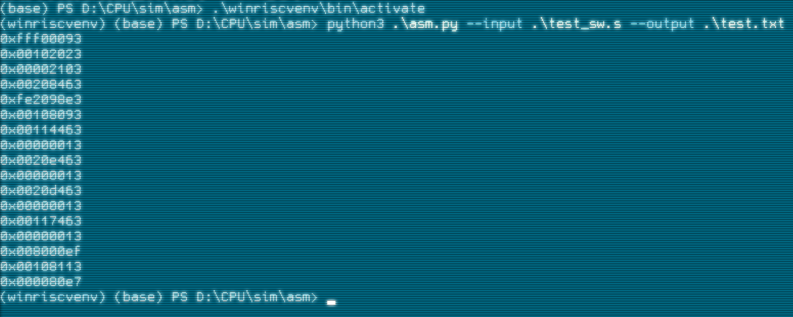

## 进入虚拟环境
```.\winriscvenv\bin\activate```
这一步每个人可能不一样，运行自己的虚拟环境下的activate，一般在“虚拟环境目录/bin”或者“虚拟环境/Scripts”下
## 运行python脚本
```python3 ./asm.py --input [inputfilename] [--output outputfilename]```   
或者   
```python ./asm.py --input [inputfilename] [--output outputfilename]```  
--input 是必须的，--output可选，但是后缀只能为.txt   

